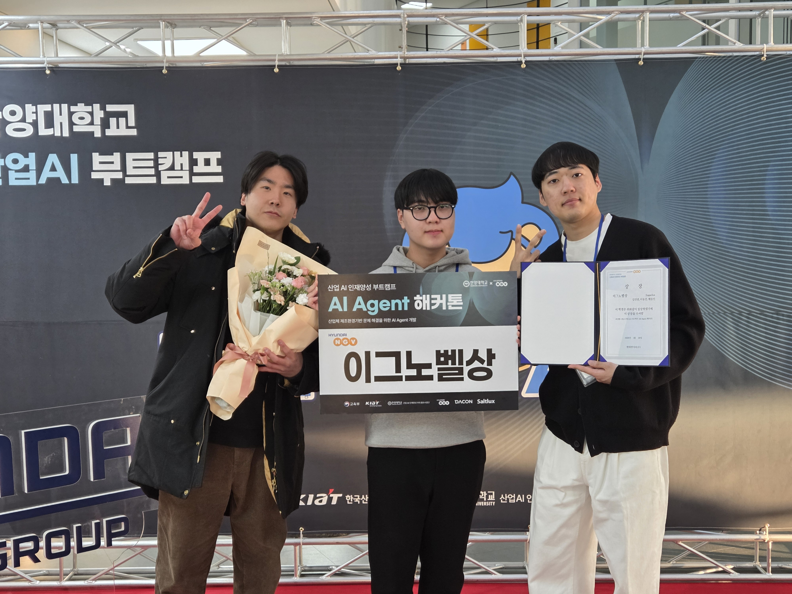
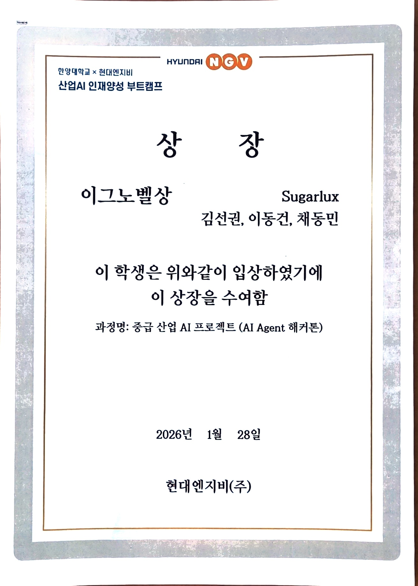
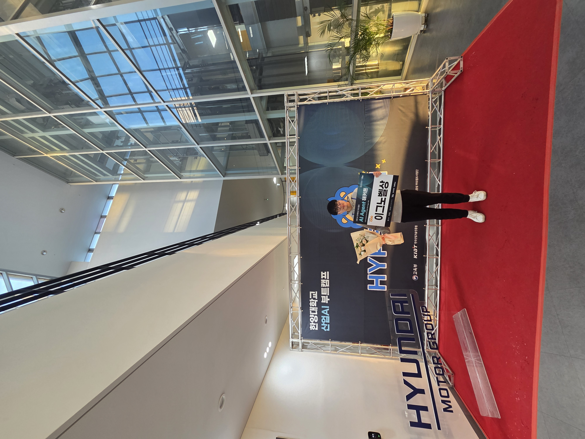
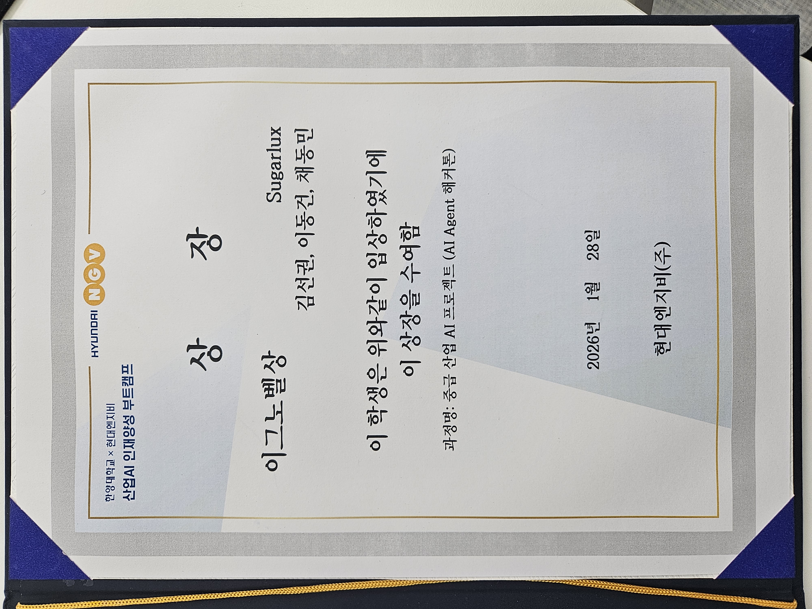
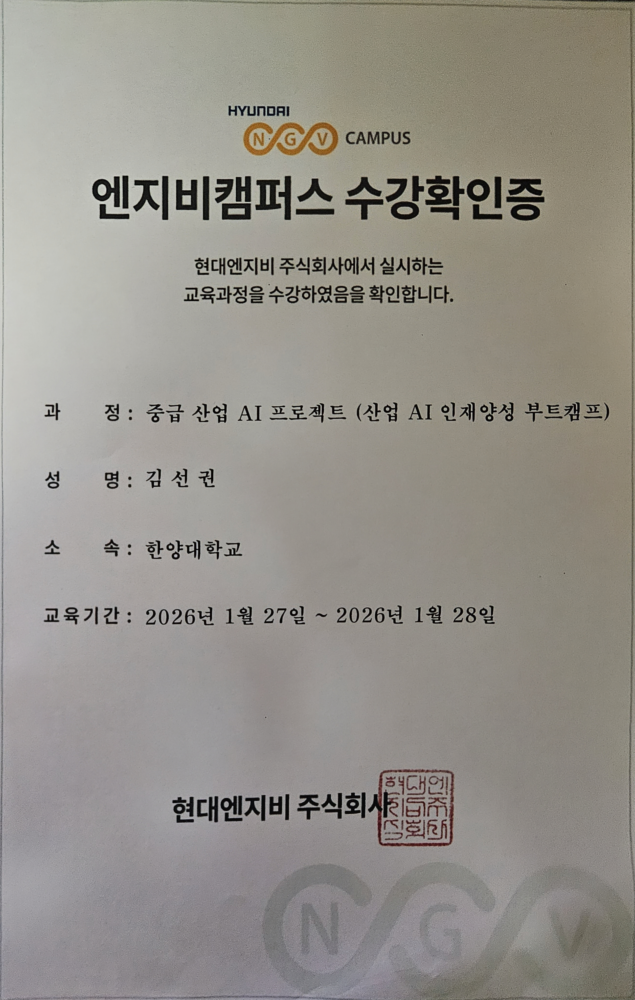
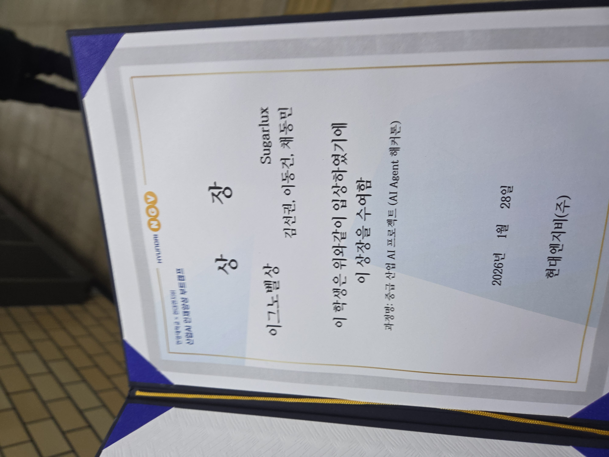
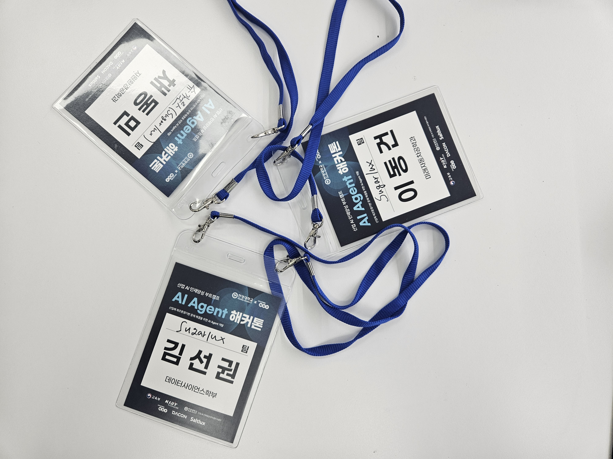

# 제조공정 이미지 분류 AI Agent

**한양대학교 × 현대엔지비 산업AI 인재양성 부트캠프 — AI Agent 해커톤 🏆 이그노벨상**

> IC(집적회로) 부품의 불량 여부를 멀티모달 LLM 기반 AI Agent로 자동 분류하는 시스템
> 팀 **Sugarlux** · 리더보드 F1 **0.76** (V8) · **이그노벨상** 수상 (2026.01.28, 현대엔지비)

---

## 🏆 수상 내역

### 이그노벨상 — 중급 산업 AI 프로젝트 (AI Agent 해커톤)

| 항목 | 내용 |
| --- | --- |
| 대회 | 한양대학교 × 현대엔지비 산업AI 인재양성 부트캠프 · AI Agent 해커톤 (산업체 제조환경 기반 문제 해결을 위한 AI Agent 개발) |
| 수상 | **이그노벨상** |
| 팀 | Sugarlux |
| 수여 | 현대엔지비(주), 2026년 1월 28일 |
| 교육기간 | 2026.01.27 ~ 2026.01.28 |

<p align="center">
  
  
</p>

<details>
<summary><b>수상 사진 · 증빙 더 보기</b></summary>

<p align="center">
  
  
  
</p>
<p align="center">
  
  
</p>

</details>

### 수상 후기

저는 반도체 제조 공정 이미지의 불량을 탐지하는 AI Agent 해커톤에 참가하여, 리더보드 F1-Score **0.76**을 달성하고 이그노벨상을 수상했습니다.

초기에는 모델의 전반적인 정확도를 높이기 위해 과검출(False Positive)을 줄이는 데 집중하였습니다. 그러나 F1-Score가 0.5대에 머물며 낮은 순위에서 벗어나지 못했고, 문제의 원인을 파악하기 위해 모델이 출력한 예측 결과를 이미지 하나하나와 직접 대조하는 과정을 거쳤습니다. 그 과정에서 중요한 사실을 발견했습니다. 모델이 정상으로 판단한 이미지 중 일부가, 사람이 보기에는 명백한 불량이었던 것입니다.

이 경험을 통해 단순한 수치 최적화보다 더 근본적인 질문을 스스로에게 던지게 되었습니다. '제조 현장에서 AI 모델에게 진짜 요구되는 것은 무엇인가?' 라는 질문이었습니다. 불량을 놓치는 미검(False Negative) 한 건은 곧 현장의 품질 사고로 이어질 수 있기에, 정확도보다 안정성, 즉 불량을 빠뜨리지 않는 구조가 더 중요하다는 결론에 이르렀습니다.

이에 성능 최적화의 기준을 정확도(Accuracy)에서 안정성(Recall 중심 F1)으로 전환하고, 두 가지 기술적 개선을 적용하였습니다. 첫째, 패키지 Body의 미세 파손을 탐지하기 위해 ROI(관심 영역) 기반 프롬프트를 설계하여 내부 칩 노출 여부를 정밀하게 판별하도록 하였습니다. 둘째, Lead(리드)의 그림자와 실제 단선을 구분하는 문제를 해결하기 위해 STANDARD/STRICT 이중 프롬프트 구조를 도입하였습니다. 1차 분석에서 불확실한 결과가 나올 경우 자동으로 Strict 모드 재검증을 수행하는 Judge-Think-Act-Verify 반복 루프를 설계함으로써, 조명 아티팩트에 의한 오탐과 실제 결함을 안정적으로 분리하였습니다.

그 결과, 육안으로도 구분하기 어려운 결함까지 안정적으로 검출하는 Agent를 완성하였고, 이그노벨상을 수상할 수 있었습니다. 이 경험은 AI 모델의 성능을 단순 수치가 아닌 현장의 맥락과 비용으로 바라보는 시각을 길러 준 소중한 기회였습니다.

---

## 목차

1. [프로젝트 개요](#프로젝트-개요)
2. [문제 정의 및 도메인 배경](#문제-정의-및-도메인-배경)
3. [AI Agent 아키텍처](#ai-agent-아키텍처)
4. [핵심 코드 구조](#핵심-코드-구조)
5. [불량 분류 기준 (도메인 지식)](#불량-분류-기준-도메인-지식)
6. [프롬프트 설계 전략](#프롬프트-설계-전략)
7. [버전별 실험 결과](#버전별-실험-결과)
8. [설치 및 실행](#설치-및-실행)
9. [평가 기준](#평가-기준)
10. [프로젝트 구조](#프로젝트-구조)

---

## 프로젝트 개요

### 과제 설명

제조공정(PCB 기판 위 IC 소자 납땜 검사)을 촬영한 이미지 **100장**을 입력으로 받아, 각 이미지를 **정상(0) / 비정상(1)** 으로 분류하는 AI Agent 시스템을 구현합니다.

### 사용 기술 스택

| 항목 | 내용 |
|------|------|
| **LLM** | Saltlux LUXIA Platform (Luxia3-LLM-32B, GPT-4o-mini) |
| **API 방식** | OpenAI ChatCompletions 호환 (multimodal, image_url) |
| **Agent 구조** | Judge-Think-Act-Verify (JTAV) 반복 루프 |
| **언어** | Python 3.8+ |
| **핵심 라이브러리** | requests, pandas, python-dotenv, Pillow |

### 주요 특징

- **멀티모달 처리**: 이미지를 Base64 인코딩 후 LLM에 직접 전달, 시각적 결함 탐지
- **Agent 기반 루프**: 1차 분석 → 불확실 시 엄격 재검증(Strict Re-Analysis) → 최종 판정
- **도메인 지식 내재화**: IC 불량 6가지 유형을 프롬프트에 체계적으로 반영
- **FP/FN 균형 전략**: Shadow(그림자) 오인식 방지 및 치명적 결함 우선 탐지 로직

---

## 문제 정의 및 도메인 배경

### 검사 대상

- **소자 유형**: 리드(다리)가 3개인 IC 컴포넌트 (트랜지스터, 소신호 TR 등)
- **검사 환경**: PCB 기판에 납땜된 후 촬영된 이미지
- **이미지 수**: 테스트 100장 (TEST_000 ~ TEST_099)
- **클래스 비율**: Normal 66개 : Abnormal 34개 (약 2:1 불균형)

### 불량 판정의 어려움

| 도전과제 | 설명 |
|---------|------|
| **그림자 오인식** | 리드가 어두워 보여도 연결 상태일 수 있음 (FP 주요 원인) |
| **표면 흠집** | 패키지 표면 스크래치는 기능 이상이 아님 (정상 판정) |
| **조명 아티팩트** | 촬영 각도에 따라 리드가 흐릿하게 보이는 현상 |
| **FN 위험성** | 불량을 정상으로 오분류 시 제품 출하 → 리콜 위험 |

---

## AI Agent 아키텍처

### Judge-Think-Act-Verify (JTAV) 플로우

```
이미지 입력
    │
    ▼
┌─────────────────────────────────────────────┐
│  Step 1: JUDGE (1차 관찰)                   │
│  · LLM에 이미지 + 6가지 결함 체크리스트 전송  │
│  · JSON 형식으로 true/false 결과 수신        │
│  · 모델: Luxia3-LLM-32B (STANDARD MODE)     │
└──────────────────────┬──────────────────────┘
                       │
                       ▼
┌─────────────────────────────────────────────┐
│  Step 2: THINK (분석)                       │
│  · 결함 항목 집계 및 심각도 가중치 계산      │
│  · 치명적 결함 여부 판별                    │
│  · 신뢰도 레벨 추정 (VERY_HIGH/HIGH/...)    │
└──────────────────────┬──────────────────────┘
                       │
                       ▼
┌─────────────────────────────────────────────┐
│  Step 3: ACT (판단)                         │
│  · 복수 결함 → 즉시 비정상 확정             │
│  · 단일 결함 (연결형 포함) → 불확실 → 재검증│
│  · 결함 없음 → 정상                         │
└──────────────────────┬──────────────────────┘
                       │
              [불확실 판정 시 재검증]
                       │
                       ▼
┌─────────────────────────────────────────────┐
│  Step 4: VERIFY (재검증)                    │
│  · STRICT MODE 프롬프트로 2차 분석          │
│  · 그림자 vs 진짜 절단 구별 집중            │
│  · "단일 결함 = 그림자 가능성" → 정상 전환  │
│  · 복수 결함 확인 시 비정상 확정            │
└──────────────────────┬──────────────────────┘
                       │
                       ▼
┌─────────────────────────────────────────────┐
│  최종 결과 출력                             │
│  prediction: 0 (Normal) / 1 (Abnormal)      │
│  confidence: 신뢰도 (0.0 ~ 1.0)             │
└─────────────────────────────────────────────┘
                       │
                       ▼
                  output.csv
                  (id, label)
```

### 의사결정 로직 상세

```python
# ACT 단계 핵심 로직
if defect_count >= 2:
    return ABNORMAL, uncertain=False   # 즉시 확정

if defect_count == 1:
    return ABNORMAL, uncertain=True    # 재검증 필요 (FP 방지)

return NORMAL, uncertain=False         # 결함 없음 → 정상

# VERIFY 단계 핵심 로직
if 재검증_결함수 == 1:
    return NORMAL   # "Single Defect Policy" (그림자 오인식으로 판단)

if 재검증_결함수 >= 2:
    return ABNORMAL  # 확정

if 재검증_결함수 == 0:
    return NORMAL    # 정상으로 뒤집기 (FP 방지)
```

---

## 핵심 코드 구조

### 모듈별 역할

| 파일 | 역할 | 핵심 로직 |
|:-----|:-----|:---------|
| [src/integrated_agent.py](src/integrated_agent.py) | **통합 Agent 엔진** | JTAV 4단계 전체 파이프라인 |
| [src/agent_core.py](src/agent_core.py) | **Agent 상태 관리** | AgentState 데이터클래스, 반복 루프 |
| [src/saltlux_client.py](src/saltlux_client.py) | **API 클라이언트** | Saltlux LLM 호출, 재시도 로직 |
| [src/vision_analyzer.py](src/vision_analyzer.py) | **이미지 분석기** | 결함 키워드 추출, 신뢰도 신호 분석 |
| [src/reasoner.py](src/reasoner.py) | **추론 엔진** | 비정상/정상 지표 식별, 제조 컨텍스트 분석 |
| [src/decision_maker.py](src/decision_maker.py) | **의사결정 모듈** | 심각도 기반 판단, 신뢰도 조정 |
| [src/verifier.py](src/verifier.py) | **검증 모듈** | 결정 검증, 신뢰도 최종 결정 |

### 핵심 함수 흐름

```
classify_agent_integrated(img_url)
    ├── observe(img_url, strict=False)    # JUDGE: LLM 1차 분석
    ├── think(obs1)                        # THINK: 심각도 계산
    ├── act(reasoning1)                    # ACT: 초기 판단
    │
    └── [uncertain=True 시]
        ├── observe(img_url, strict=True)  # VERIFY: 엄격 재분석
        ├── think(obs2)
        ├── act(reasoning2)
        └── verify(label, reasoning)       # 최종 확정
```

### Saltlux API 연동

```python
# 실제 사용 엔드포인트
BRIDGE_URL = "https://bridge.luxiacloud.com/llm/openai/chat/completions/{model}/create"
MODEL = "luxia3-llm-32b-0731"   # JUDGE, THINK, VERIFY 단계
MODEL_ACT = "luxia3-llm-13b-0731"  # ACT 단계 (빠른 판단)

# API 헤더 (OpenAI 호환)
HEADERS = {"apikey": API_KEY, "Content-Type": "application/json"}

# 이미지 전달 방식 (Base64 인코딩)
image_content = {
    "type": "image_url",
    "image_url": {
        "url": f"data:image/png;base64,{img_base64}"
    }
}
```

---

## 불량 분류 기준 (도메인 지식)

총 **6가지 불량 유형**을 정의하고, 각각에 심각도 가중치를 부여합니다.

| 불량 유형 | 키 | 설명 | 심각도 |
|---------|-----|------|--------|
| **유령형** | `component_missing` | 부품 전체 유실 (빈 풋프린트만 있음) | 1.00 |
| **연결형** ⭐ | `lead_connectivity_fail` | 리드 절단/미삽/합선/간격 부족 | 0.98 |
| **파손형** | `body_broken_severe` | 내부 칩·회로 노출될 정도의 파손 | 0.95 |
| **곡예형** | `posture_bad` | 부품이 누움/뒤집힘 | 0.85 |
| **회전형** | `rotation_severe` | 45도 이상 회전 정렬 불량 | 0.80 |
| **정상** | (없음) | 표면 흠집/긁힘이 있어도 기능 이상 없음 | - |

> **연결형 결함(lead_connectivity_fail)이 가장 중요**: 전기적 연결 실패 = 제품 기능 불가

### 판단 원칙

```
1. 치명적 결함(component_missing, lead_connectivity_fail) → 즉시 불량 확정
2. 기타 결함 2개 이상 → 불량 확정
3. 단일 결함 → 재검증 후 판단 (그림자 오인식 가능성 고려)
4. 결함 없음 → 정상
5. 표면 스크래치, 엣지 칩핑, 변색 → 무시 (기능 이상 없음)
```

---

## 프롬프트 설계 전략

### Standard Mode (1차 분석)

- **목표**: 높은 Recall (결함 놓침 최소화)
- **전략**: 의심스러우면 결함으로 표시 ("FN이 FP보다 나쁘다")
- **리드 검사 5단계 체크**:
  1. 리드가 명확히 보이는가?
  2. PCB 홀에 완전히 삽입되었는가?
  3. 리드가 절단/단락 없이 온전한가?
  4. 리드 간격 ≥ 1mm인가?
  5. 리드가 올바른 위치인가?

### Strict Mode (재검증)

- **목표**: 낮은 FP (False Alarm 최소화)
- **전략**: 의심스러우면 정상으로 표시
- **핵심 규칙**:
  - 어둡거나 흐린 리드 = 그림자 → **정상**
  - 진짜 밝은 Gap이 있을 때만 = **절단**
  - 표면 스크래치, 모서리 칩핑 = **정상**

### 프롬프트 출력 형식

모든 분석 결과를 JSON으로 강제 출력:

```json
{
  "component_missing": false,
  "lead_connectivity_fail": false,
  "body_broken_severe": false,
  "posture_bad": false,
  "rotation_severe": false
}
```

---

## 버전별 실험 결과

리더보드 제출 기준 **Binary F1-Score** (100장, Abnormal=1 기준):

| 버전 | TN | FP | FN | TP | F1 | Recall | Precision | 특징 |
|------|----|----|----|----|-----|--------|-----------|------|
| V3 | 0 | 66 | 0 | 34 | 0.51 | 1.00 | 0.34 | 전부 비정상 예측 |
| V4 | 55 | 11 | 27 | 7 | 0.27 | 0.21 | 0.39 | 보수적 (FN 많음) |
| V5 | 30 | 36 | 8 | 26 | 0.51 | 0.76 | 0.42 | 공격적 탐지 |
| V6 | 63 | 3 | 33 | 1 | 0.06 | 0.03 | 0.25 | 극보수 (FN 최대) |
| V7 | 13 | 53 | 7 | 27 | 0.47 | 0.79 | 0.34 | 리더보드 0.57 |
| **V8** | **26** | **40** | **16** | **18** | **0.39** | **0.53** | **0.31** | **리더보드 0.76** |
| V10 | 57 | 9 | 29 | 5 | 0.21 | 0.15 | 0.36 | Ultra-보수 |

> Ground Truth 기준 F1과 리더보드 점수가 다른 이유: 리더보드는 공식 Private GT 기준 (샘플링 방식이 다름)

### 버전 진화 스토리

```
V3 (전부 비정상)
    ↓  너무 많은 FP
V4 (보수적 전환)
    ↓  FN 급증 → Recall 붕괴
V5 (공격적 탐지 복귀)
    ↓  FP 여전히 많음
V6 (극도 보수)
    ↓  FN 최대 → F1 최하
V7 (공격적 + 재검증 추가)
    ↓  리드 그림자 오인식 문제 발견
V8 (그림자 구별 + Single Defect Policy)
    → 리더보드 0.76 달성 ← 최고 성능
V10 (Ultra-Conservative)
    → FP 최소, FN 최대 → F1 하락
```

### 핵심 인사이트

1. **"한쪽 극단"은 항상 F1을 떨어뜨린다** - FP↑ 또는 FN↑ 모두 불리
2. **그림자 오인식이 주요 FP 원인** - 어두운 리드를 절단으로 오분류
3. **Single Defect Policy** - 재검증에서도 단일 결함만 발견되면 정상 처리
4. **V8이 최고 성능인 이유** - FP 억제 + 알려진 오인식 패턴 회피의 균형

---

## 설치 및 실행

### 1. 환경 구성

```bash
# Python 3.8+ 확인
python --version

# 의존성 설치
pip install -r requirements.txt

# 환경 설정
cp .env.example .env
```

### 2. API 키 설정

`.env` 파일 편집:

```bash
SALTLUX_API_KEY=YOUR_ACTUAL_API_KEY_HERE
SALTLUX_API_BASE_URL=https://bridge.luxiacloud.com/llm/openai/chat/completions/{model}/create
```

### 3. 실행 방법

**방법 1: 최종 V8 모델 실행 (권장 - Leaderboard 0.76)**
```bash
python run_v8.py
```

**방법 2: 통합 Agent 실행 (URL 기반)**
```bash
python -m src.integrated_agent
```

**방법 3: 로컬 이미지 분류**
```bash
python final_classify.py
```

**방법 4: Jupyter Notebook**
```bash
jupyter notebook notebooks/ai_agent.ipynb
```

### 4. 결과 확인

```
outputs/output.csv
├── 형식: id, label
├── label: 0 = Normal, 1 = Abnormal
└── 인코딩: UTF-8

예시:
id,label
DEV_000,0
DEV_001,1
...
```

---

## 평가 기준

### 대회 채점 (총 100점)

| 항목 | 배점 | 설명 |
|------|------|------|
| **리더보드 성능** | 30점 | Binary F1-Score 기반 |
| **문제 접근 & 설계 논리** | 25점 | Agent 기반 설계의 논리성 |
| **Agent Flow 완성도** | 35점 | Judge-Think-Act-Verify 구조 명확성 |
| **효율성 & 실용성** | 10점 | API 호출 효율, 재현 가능성 |

### 리더보드 평가

| 구분 | 설명 |
|------|------|
| **평가 지표** | Binary F1-Score |
| **Public Score** | 전체 100장 중 50장 샘플 (대회 기간 중 공개) |
| **Private Score** | 전체 100장 (대회 종료 후 최종 순위 결정) |
| **최고 성능** | **V8: 0.76** |

---

## 프로젝트 구조

```
산업AI_Agnet_해커톤/
│
├── README.md                    # 이 파일
├── requirements.txt             # Python 의존성
├── .env.example                 # 환경 설정 예시
├── .env                         # 실제 API 키 (직접 생성)
│
├── run_v8.py                    # V8 메인 실행기 (최고 성능)
├── final_classify.py            # 로컬 이미지 분류 실행기
├── int1.py                      # 통합 Agent 테스트 스크립트
├── modeltest.py                 # 모델 테스트 스크립트
├── compare_misses.py            # FN/FP 비교 분석 스크립트
├── data.csv                     # 입력 데이터 (이미지 URL 목록)
│
├── src/                         # 소스 코드
│   ├── __init__.py
│   ├── config.py                # 설정 관리
│   ├── integrated_agent.py      # 통합 AI Agent (핵심 실행 파일)
│   ├── agent_core.py            # Agent 핵심 로직 (상태 관리)
│   ├── image_processor.py       # 이미지 전처리
│   ├── saltlux_client.py        # Saltlux API 클라이언트
│   ├── vision_analyzer.py       # 이미지 분석기
│   ├── reasoner.py              # 추론 엔진
│   ├── decision_maker.py        # 의사결정 모듈
│   ├── verifier.py              # 검증 모듈
│   └── utils.py                 # 유틸리티 함수
│
├── notebooks/
│   └── ai_agent.ipynb           # 최종 Jupyter Notebook
│
├── outputs/
│   └── output.csv               # 최종 예측 결과 (id, label)
│
├── assets/award/                # 수상 사진 · 상장 · 수강확인증
├── 발표자료/                     # 발표 슬라이드 (PDF/PNG)
│
├── docs/                        # 문서
│   ├── V7_V8_분석_요약.md
│   ├── 버전별_혼동행렬_분석.md
│   ├── 플로우_설계_장점.md
│   └── WORKFLOW_DIAGRAMS.md
│
└── logs/                        # 실행 로그
    └── agent_*.log
```

---

## 제약사항

1. **Saltlux API만 사용**: 다른 LLM API 사용 금지
2. **외부 데이터 불가**: 제공된 데이터만 사용
3. **자동화 필수**: 수동 개입 없이 End-to-End 자동 처리
4. **제출 마감**: 2026-01-28 13:00 (UTC+9)

## 제출 항목

- [x] `ai_agent.ipynb`: Jupyter Notebook
- [x] `output.csv`: 최종 예측 결과
- [x] `presentation.pdf`: 발표자료 (< 20MB) — `발표자료/slide_2.pdf`

---

**Last Updated**: 2026-03-13
**Best Score**: V8 - Leaderboard F1: **0.76**
